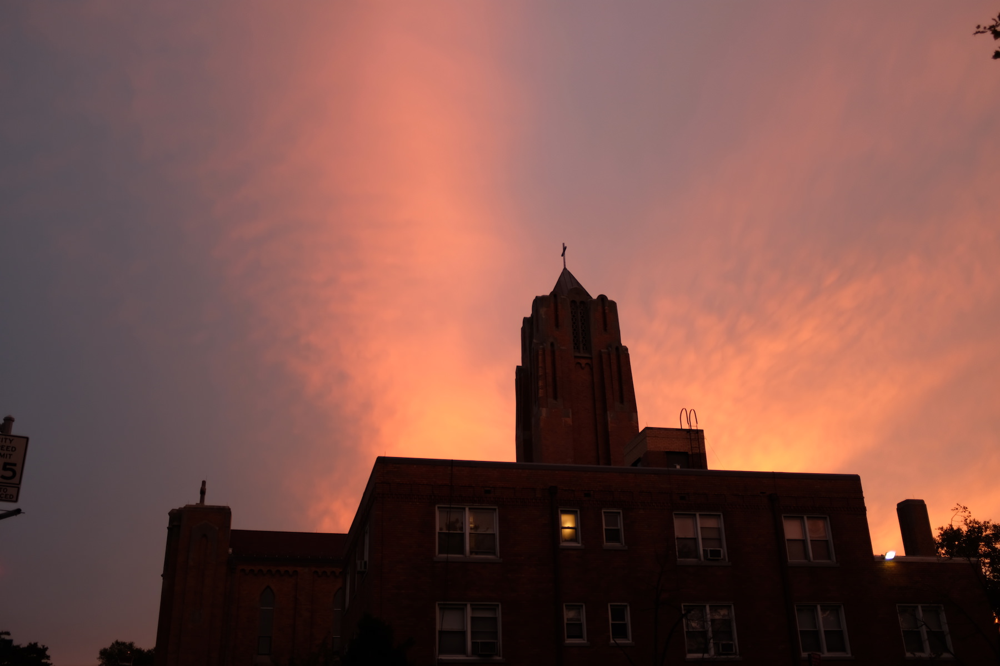

So tired. So very tired. It’s just over a week since Jacob Blake was shot in the back by police in front of his children. Less than a week from the Kyle Rittenhouse murders. The president is planning to go to Kenosha this week. “ThE PoLiCe aRe uNdEr sIeGe.”

Spent some time reading [_A Bookshop in Berlin_](https://www.simonandschuster.com/books/A-Bookshop-in-Berlin/Francoise-Frenkel/9781501199851) this morning. I’m about half way through and I think that the original title _No Place to Lay One’s Head_ feels way more accurate! It is quite bleak! There is no rest. Curious why the U.S. version took on this title, probably says more about us than anything else.

Day 175 of these work from heck times. I felt pent up and frustrated and irritable today. In an attempt to rectify I biked around for an hour or so after work chasing the sunset, trying to get the best unobstructed view, Green-Wood endeavored but didn’t fully deliver.

Tonight I did a double feature of documentaries about dudes who devote themselves to their passions: [‎John Was Trying to Contact Aliens](https://letterboxd.com/film/john-was-trying-to-contact-aliens/) and [‎The Cruise](https://letterboxd.com/film/the-cruise/). I’ve lost some of my optimism that people could be more than cruel and selfish, but was buoyed by the generosity and maybe weirdness of these two fellas.

Today I joined:

* [Rachel Syme’s](http://www.rachelsyme.com/) [PenPal Palooza](https://www.elfster.com/gift-exchanges/de5bbe31-5d99-4411-9c80-a29c4b33abd1/?join=zgu1)
* [Tamara Shopsin’s](https://tamarashopsin.com/) [email list](https://us14.campaign-archive.com/home/?u=02786b3ce6d8524a9e7027cfd&id=953a9ac785)
* [Noah Kalina’s](http://noahkalina.com/) [newsletter](https://mailchi.mp/6068da7c609b/noahkalina)
* The [Fotofolio](http://fotofolio.com/) [postcard subscription](https://www.fotofolioshop.com/shop/subscription-hjy5e)
